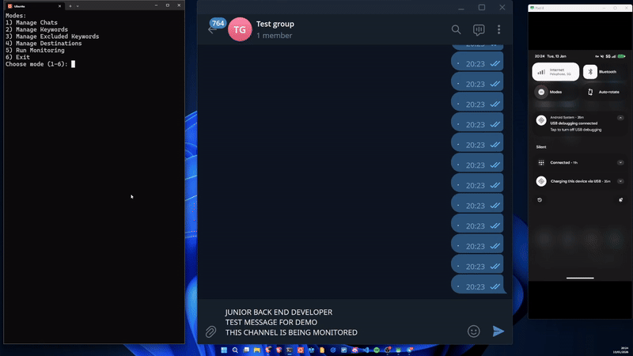

<h1 align="center">📡 TeleWatch</h1>

<p align="center">
  <strong>Monitor Telegram chats, forward what you need.</strong><br>
  A lightweight daemon that watches Telegram chats for keywords and forwards matches to multiple channels.<br>
  Supporting forwarding through Telegram, Email, SMS, WhatsApp, Discord and ntfy.sh.
</p>

<p align="center">
  
  
</p>

<p align="center">
  
</p>

---

## 🚀 Quick Start

1. **Get API credentials** from [my.telegram.org/apps](https://my.telegram.org/apps)
2. **Create `.env`** file with your credentials (see [Configuration](#configuration))
3. **Run** `python main.py`
4. **Authenticate** with your Telegram account on first run
5. **Configure** chats, keywords, and destinations via the interactive menu

---

## Features

- **Multi-Chat Monitoring** — Watch multiple Telegram chats simultaneously
- **Keyword Filtering** — Case-insensitive matching with exclusion support
- **Multi-Channel Forwarding** — Telegram, Email, SMS, WhatsApp, ntfy.sh, Discord
- **Docker Support** — Ready for 24/7 daemon operation
- **Health Monitoring** — Built-in heartbeat for external monitoring

---

## Installation

### Option 1: Using requirements.txt (Recommended)

```bash
git clone git@github.com:orizaruk/TeleWatch.git
cd TeleWatch
python -m venv venv
source venv/bin/activate  # Linux/Mac
# or: .\venv\Scripts\Activate.ps1  # Windows (PowerShell)

pip install -r requirements.txt
```

### Option 2: Manual Install

```bash
pip install telethon python-dotenv   # Core
pip install twilio                   # Optional: SMS/WhatsApp
```

---

## ⚙️ Configuration

### Environment Variables (.env)

Create a `.env` file in the project root:

```bash
# Required - Telegram API
API_ID=your_api_id
API_HASH=your_api_hash

# Optional - Email notifications (Gmail)
EMAIL_ADDRESS=your@gmail.com
EMAIL_APP_PASSWORD=your_app_password

# Optional - SMS/WhatsApp (Twilio)
TWILIO_ACCOUNT_SID=ACxxxxxxxxxxxxxxxxxxxxxxxxxxxxx
TWILIO_AUTH_TOKEN=xxxxxxxxxxxxxxxxxxxxxxxxxxxxxxxx
TWILIO_PHONE_NUMBER=+1234567890
```

### Config File (config.json)

Auto-generated on first run. Stores:

| Key | Description |
|-----|-------------|
| `chats` | List of Telegram chat IDs to monitor |
| `keywords` | Keywords to match (case-insensitive) |
| `excluded_keywords` | Keywords to ignore even if matched |
| `destinations` | Settings for each notification channel |

---

## 🎯 Usage

### Interactive Mode

```bash
python main.py
```

Use the menu to configure chats, keywords, and destinations. This creates `config.json` and `sesh.session`.

### Daemon Mode

```bash
python main.py -m
```

Skips menu, starts monitoring immediately. Stops on SIGTERM/SIGINT (Linux/macOS) or Ctrl+C.

> **Note:** On Windows, daemon mode has limited signal handling. For 24/7 operation, Docker deployment is recommended.

### CLI Options

| Flag | Description |
|------|-------------|
| `-m` | Daemon mode (skip menu, start monitoring) |
| `-v` | Warning-level logging |
| `-vv` | Debug-level logging |

---

## 🐳 Docker Deployment

For 24/7 unattended operation:

### 1. Configure First (on host)

```bash
python main.py
# Authenticate with Telegram, configure chats/keywords/destinations
```

This creates `sesh.session` and `config.json` which are prerequisites.

### 2. Run with Docker Compose

```bash
docker compose up -d      # Start in background
docker compose logs -f    # View logs
docker compose down       # Stop gracefully
```

### Environment Variable Overrides

Configure via environment instead of `config.json` (useful for CI/CD):

```bash
TELEWATCH_CHATS=123456789,-987654321
TELEWATCH_KEYWORDS=python,remote,developer
TELEWATCH_EXCLUDED_KEYWORDS=intern,junior
TELEWATCH_DESTINATIONS='{"telegram":{"enabled":true,"chat_id":123},"email":{"enabled":true,"recipients":["alerts@example.com"]}}'
```

`TELEWATCH_DESTINATIONS` merges into the file-based configuration instead of replacing it.

### WhatsApp Note

WhatsApp support uses the Twilio Sandbox and is hidden from the interactive menu. To enable it, stop the app and set it in `config.json` or via `TELEWATCH_DESTINATIONS`.

---

## External Service Setup

<details>
<summary><strong>Telegram API (Required)</strong></summary>

1. Go to [my.telegram.org/apps](https://my.telegram.org/apps)
2. Log in with your phone number
3. Create a new application
4. Copy the `api_id` and `api_hash` to your `.env` file

</details>

<details>
<summary><strong>Gmail (for Email notifications)</strong></summary>

1. Enable 2-Factor Authentication on your Google account
2. Go to [myaccount.google.com/apppasswords](https://myaccount.google.com/apppasswords)
3. Generate a new App Password for "Mail"
4. Use the 16-character password (without spaces) in your `.env`

</details>

<details>
<summary><strong>Twilio (for SMS/WhatsApp)</strong></summary>

1. Create an account at [twilio.com](https://www.twilio.com/)
2. Get your Account SID and Auth Token from the [Console](https://console.twilio.com/)
3. Get or purchase a phone number with SMS capability
4. For WhatsApp: Recipients must first opt-in via the [Twilio WhatsApp Sandbox](https://console.twilio.com/us1/develop/sms/try-it-out/whatsapp-learn)

</details>

<details>
<summary><strong>ntfy.sh (for push notifications)</strong></summary>

1. Go to [ntfy.sh](https://ntfy.sh/)
2. Create a topic (or use a random one for privacy)
3. Subscribe to the topic on your phone using the [ntfy app](https://ntfy.sh/#subscribe-phone)
4. Enter just the topic name in the configuration (e.g., `mytopic`, not the full URL)

No account or API key required — ntfy.sh is free and open source.

</details>

<details>
<summary><strong>Discord (for webhook notifications)</strong></summary>

1. Open Discord and go to the channel where you want notifications
2. Click the gear icon (Edit Channel) → Integrations → Webhooks
3. Click "New Webhook" and customize the name/avatar if desired
4. Copy the webhook URL and paste it in the configuration

</details>

---

## Health Monitoring

The bot writes a timestamp to `health.txt` every 60 seconds. External monitoring can check file age.

**Linux/macOS:**
```bash
find . -name "health.txt" -mmin -2 | grep -q . && echo "healthy" || echo "stale"
```

**Windows (PowerShell):**
```powershell
if ((Get-Item health.txt -ErrorAction SilentlyContinue).LastWriteTime -gt (Get-Date).AddMinutes(-2)) { "healthy" } else { "stale" }
```

---

## Project Structure

```
telewatch/
├── main.py              # Entry point, CLI menu, monitoring loop
├── config.py            # Configuration management + env var loading
├── Dockerfile           # Container image definition
├── docker-compose.yml   # Container orchestration
├── requirements.txt     # Python dependencies
├── notifiers/
│   ├── __init__.py      # Base class, retry logic, registry
│   ├── telegram.py      # Telegram forwarding
│   ├── email.py         # Gmail SMTP
│   ├── sms.py           # Twilio SMS
│   ├── whatsapp.py      # Twilio WhatsApp
│   ├── ntfy.py          # ntfy.sh push notifications
│   └── discord.py       # Discord webhook
│
# Generated files (gitignored):
├── config.json          # Runtime config (auto-generated)
├── sesh.session         # Telegram auth session
├── health.txt           # Health check timestamp
└── bot.log              # Application logs (rotated at 5MB)
```

---

## Privacy

- **Your credentials stay local** — API keys are only used to connect to services you configure
- **No telemetry** — The app doesn't phone home or collect usage data
- **Session file** — `sesh.session` contains your Telegram auth; keep it secure

---

## Contributing

Contributions are welcome! Please feel free to submit a Pull Request.
